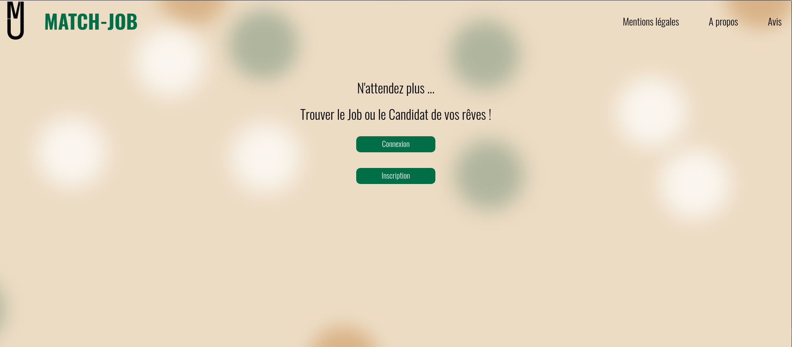

# Projet-match-job-front

"Trouvez le Job ou le Candidat de vos rêves !!!"

## What is Match-Job?

Match-Job is a job search application if you are a candidate or a candidate search if you are a company

The principle is quite simple:

- On the **candidate** side, after registering, you will have to edit your profile, once the profile has been filled in:
  - The title of the job you are looking for
  - The type of job you are looking for
  - The experience
  - Skills

The Match-Job engine will present you with the job offers that correspond to you in the form of cards, all you have to do is click
on the "interested" button or swipe if you are not interested.

If you click on the button and the recruiter does the same in return there is a MATCH you both have access to your details
to arrange a meeting!

- If you are a **recruiter**, after registration you will complete your profile.
  Once this is done, you can create one or more advertisements by filling in the form:
  - Job title
  - Type of contract
  - Experience required
  - Skills
  - A description of the position

The Match-Job engine will then present you with a list of potential candidates that correspond to your expectations, in the form of cards, you will then have 2 choices: either click on the "interested" button or swipe to see another card that corresponds to another candidate

If you click on the "interested" button, a notification will be sent to the candidate who may or may not be interested.

If the candidate is also interested then there is a Match!  Both you and the candidate will have released your respective contact details to arrange an interview.
